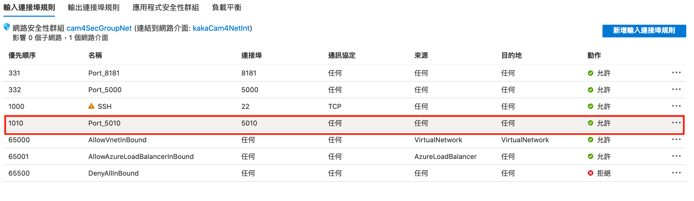

# A YOLOv3 OVMS Service with REST API to Azure IoT Edge

This repo shows how to create a own inference module with [OpenVINO&trade; Model Server (OVMS)](https://github.com/openvinotoolkit/model_server) and deploy to [Azure IoT Edge](https://docs.microsoft.com/en-us/azure/iot-edge/?view=iotedge-2018-06)

In this repo, we would build a docker container with a `YOLOv3 OpenVINO (IR)` model using `OVMS`, `nginx`, `gunicorn`, `flask` and `runit`.

- [1. Create an Inference module (For testing container)](#1-create-an-inference-module-for-testing-container)
- [2. Deploy a `Docker Compose` project to `IoT Edge`](#2-deploy-a-docker-compose-project-to-iot-edge)

## Prerequisites

1. An IoT hub in your Azure subscription.
2. An IoT Edge device.

## 1. Create an Inference module (For testing container)

### 1-1. Download YOLOv3 OpenVINO Model

Download `yolo_v3.xml` and `yolo_v3.bin`, and then move them into `model/1` folder

- [yolo_v3.xml](https://drive.google.com/file/d/1d6S7e-7XCeuSapGe0QfmJ9ZKxKJgl5S-/view?usp=sharing)
- [yolo_v3.bin](https://drive.google.com/file/d/1hQMYSRs8HygTvkHLl0Fsrb3KNavF1wC-/view?usp=sharing)

### 1-2. Build and Run with docker-compose

```bash
# build and run
$ docker-compose build & docker-compose up

# run in backend
$ docker-compose up -d
```

#### Stop docker-compose

```bash
$ docker-compose down
```

### 1-3. Testing

After started service, you can open [http://127.0.0.1:500](http://127.0.0.1:5000), you would see "Hello from Yolov3 inferencing based OVMS"

#### "/score"

To get a list of detected objects, use the following command.

```bash
$ curl -X POST http://127.0.0.1:5010/score -H "Content-Type: image/jpeg" --data-binary @<full_path_to_image_file_in_jpeg>

# example with pretty-print JSON
$ curl -X POST http://127.0.0.1:5010/score -H "Content-Type: image/jpeg" --data-binary @images/dog.jpg | python -m json.tool
```

If successful, you will see JSON printed on your screen that looks something like this

```json
{
    "inferences": [
        {
            "entity": {
                "box": {
                    "h": "0.5559119",
                    "l": "0.14300361",
                    "t": "0.22801572",
                    "w": "0.5901649"
                },
                "tag": {
                    "confidence": "0.53395486",
                    "value": "bicycle"
                }
            },
            "type": "entity"
        },
        {
            "entity": {
                "box": {
                    "h": "0.1446465",
                    "l": "0.600061",
                    "t": "0.13548738",
                    "w": "0.2928388"
                },
                "tag": {
                    "confidence": "0.5238078",
                    "value": "truck"
                }
            },
            "type": "entity"
        },
        {
            "entity": {
                "box": {
                    "h": "0.546983",
                    "l": "0.15526156",
                    "t": "0.39115456",
                    "w": "0.25584072"
                },
                "tag": {
                    "confidence": "0.5342895",
                    "value": "dog"
                }
            },
            "type": "entity"
        }
    ]
}
```

## 2. Deploy a `Docker Compose` project to `IoT Edge`

Detail: [Convert Docker Compose project to Azure IoT Edge Solution and Deploy](https://github.com/kaka-lin/azure-notes/blob/master/iotedge/04_deploy_docker_compose_project.md)

### 2-1. Convert a `Docker Compose` project to `IoT Edge Solution`

```bash
$ pip3 install iotedge-compose

# for ovms-app
$ iotedge-compose \
    -t project \
    -i ./docker-compose.yml \
    -o ../EdgeSolution && mv ../EdgeSolution .
```

##### Note:

```
I already deleted redundant files in EdegeSolution folder
```

#### Go to EdgeSolution Folder

Open `converted edge project` with VS Code

```
$ code EdgeSolution
```

### 2-2. Update the your Container Registry info

In this example, I use `Docker Hub`

1. `.env` file

```
CONTAINER_REGISTRY_USERNAME=
CONTAINER_REGISTRY_PASSWORD=
CONTAINER_REGISTRY_ADDRESS=docker.io
```

2. `module.json`

```json
{
    "$schema-version": "0.0.1",
    "description": "",
    "image": {
        "repository": "<YOUR_REPOSITORY_NAME>/ovms-app",
        "tag": {
            "version": "0.0.1",
            "platforms": {
                "amd64": "app.Dockerfile"
            }
        },
        "buildOptions": [],
        "contextPath": "./"
    }
}
```

Example, In my case:

```json
{
    "$schema-version": "0.0.1",
    "description": "",
    "image": {
        "repository": "kakalin/ovms-app",
        "tag": {
            "version": "0.0.1",
            "platforms": {
                "amd64": "app.Dockerfile"
            }
        },
        "buildOptions": [],
        "contextPath": "./"
    }
}
```

### 2-3. Deploy modules to Azure IoT Edge

- [Deploy Azure IoT Edge modules from Visual Studio Code](https://github.com/kaka-lin/azure-notes/blob/master/iotedge/01_deploy_modules.md)

## 2-4. Expose VM's port

When Deployment succeeded, don't forget to expose yor vm's port, like:



## 7. Result

If you can access the IoT Edge device via public IP with port 5010 allowed,
the demo page can be visited in your browser with `http://<IoTEdgeDeviceAddress>:5010/`, you would see "Hello from Yolov3 inferencing based OVMS".

Then, you can test `"/score"` using `curl` or `python:request`, as below:

### `Curl`

```bash
# example with pretty-print JSON
$ curl -X POST http://<IoTEdgeDeviceAddress>:5010/score -H "Content-Type: image/jpeg" --data-binary @<full_path_to_image_file_in_jpeg> | python -m json.tool
```
### `Python:request`

```bash
$ python3 test.py <IP Address> <path_to_image_file>
```
